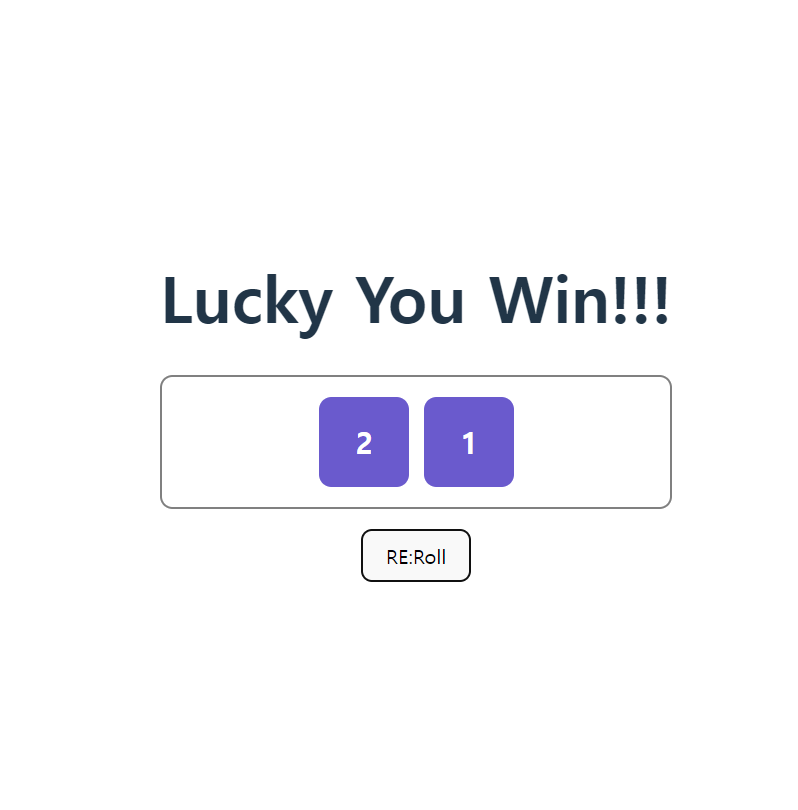

# 주사위 게임 웹애플리케이션

;

- 주사위를 랜덤으로 돌려 주사위 눈의 합이 특정 수보다 작으면 이겼음을 표시하는 간단한 웹애플리케이션을 구축해보았다.
- 전역적으로 사용하는 함수들의 경우 사용하는 컴포넌트마다 선언하여 사용하기보다 따로 utils 폴더에 함수를 작성해 필요할 때마다 가져와서 사용하는 구조로 작성하며, 코드를 간소화시킬 수 있었다.
